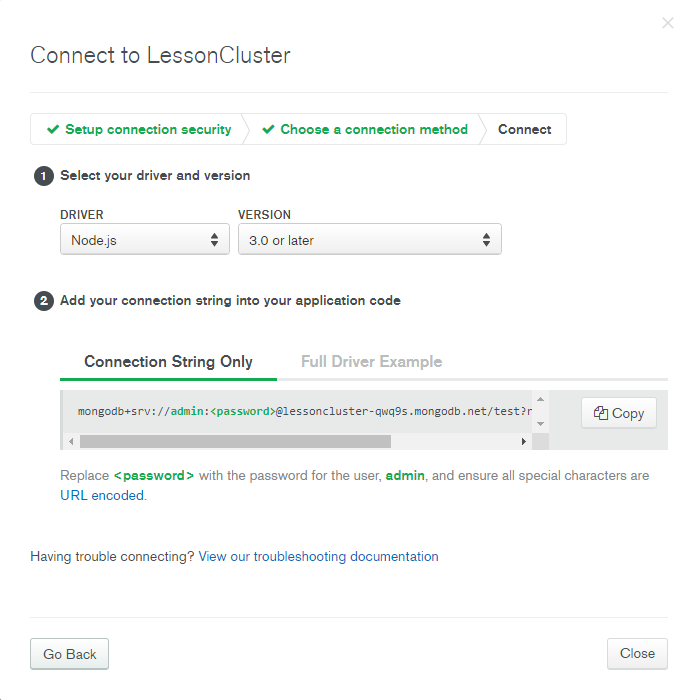

# RS School NodeJS course

## Task 2. Express REST service

Let's try to create a competitor for Trello!

**Create an [Express](https://expressjs.com/ru/) application, the application should operate with the following resources:**

- User (with attributes):
  ```javascript
  { id, name, login, password }
  ```
- Board (set of columns):
  ```javascript
  { id, title, columns }
  ```
- Column (set of tasks):
  ```javascript
   { id, title, order }
  ```
- Task:
  ```javascript
  {
    id,
    title,
    order,
    description,
    userId, //assignee
    boardId,
    columnId
  }
  ```

**Details:**

1. For User, Board and Task REST endpoints with separate router paths should be created
    * `/users`
      * `GET /users` - get all users (remove password from response)
      * `GET /users/:id` - get the user by id (ex. “/users/123”) (remove password from response)
      * `POST /users` - create user
      * `PUT /users` - update user
      * `DELETE /users/:id` - delete user
    * `/boards`
      * GET all
      * GET by id
      * POST
      * PUT
      * DELETE
    * `/tasks`
      * GET all by boardId
      * GET by id
      * POST
      * PUT
      * DELETE

2. When somebody DELETE Board, all its Tasks should be deleted as well.

3. When somebody DELETE User, all Tasks where User is assignee should be updated to put userId=null.

4. For now, these endpoints should operate only with in-memory (hardcoded) data, in the next tasks we will use a DB for it. You may organize your modules with the consideration that the data source will be changed soon.

5. An application/json format should be used for request and response body.

6. Do not put everything in one file - use a separate file for application creation (bootstrapping), for controllers (routers) and code related to business logic. Also split files to different modules depends on a domain (user-related, board-related, etc...).

7. To run the service “npm start” command should be used.

8. Service should listen on PORT 4000.

**Hints**

* To test the service CRUD methods you can use Swagger html (see [README.md](https://github.com/rolling-scopes-school/nodejs-course-template/blob/master/README.md#running-application)).
* To generate all entities “id”s use [uuid](https://www.npmjs.com/package/uuid) package.


## Task 3. Logging & Error Handling

Add logging functionality to already existing REST service.

1. Add express middleware which will log incoming requests to service (url, query parameters, body).
2. Add express middleware which will log all unhandled errors and return a standard message with HTTP code 500 (Internal Server Error).

3. Add errors handling to `process.on(‘uncaughtException’,...)`.
4. Add Unhandled promise rejection listener to log error
5. `console.log` or writing to a file can be used for logging. Any third-party logging library can also be used for this purpose.

## Task 4. Database MongoDB

1. Use MongoDB database to store REST service data (Users, Boards, Tasks).

- Follow the [MongoDB Atlas registration link](https://www.mongodb.com/cloud/atlas/register).
- Feel all mandatory fields and click create account button.
- Choose “Starter Cluster” option and click Create a cluster.
- The next screen choose: cloud provider - AWS, region - Ireland (eu-west-1) and click “Create Cluster” button (Not change another options).
- Click Security - Database access tab.
- Click Add new user button.
- Choose method - Password and fill the username and the password fields (remember them, you will use them to connect mongodb database).
- User Privileges - Set read and write to any database.
- Click “Add user” button.
- Click Security - Network Access tab.
- Click “Add IP Address” button.
- Click “Allow access from anywhere” button.
- Click “Confirm” button.
- You can generate connect string, by the following: in Atlas - Clusters tab click “Connect” button.
- On Modal window (Connect to Cluster) click “Connect your Application” button. The window should look similar as in the picture:



2. Use [Mongoose ODM](https://mongoosejs.com/) to store and update data.
3. The information on DB connection (connection string) should be stored in `.env` file and should be passed to the application using the environment variables with the help of the following [dotenv package](https://www.npmjs.com/package/dotenv).
